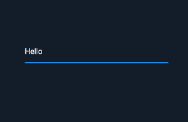
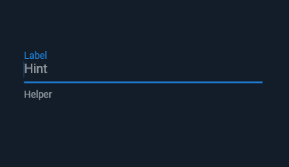
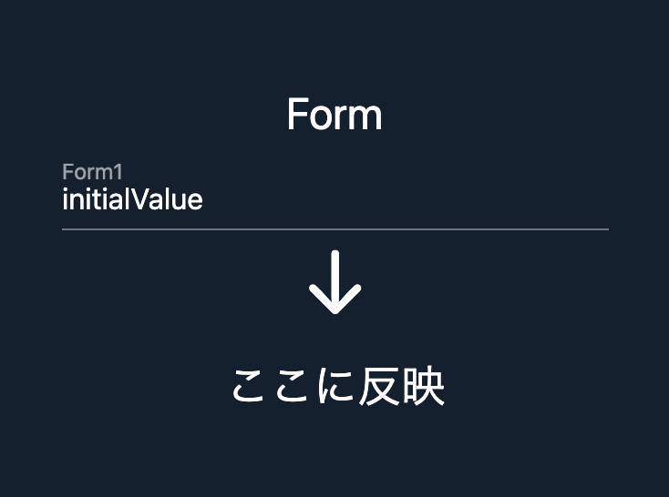

# フォームを **正しく** 使いこなそう

---

# フォーム
Form

フォームはほとんどのアプリに登場します。

- ログインフォーム
- メッセージなどの入力フォーム
- 検索用フォーム

これらのフォームを正しく使いこなしたいですね！

---

# はじめにおことわり

FlutterにはForm Widgetというものがあります。

以下のようなルールで説明します。

- Formと英語表記する場合は Flutterが提供する特定の <span style="color:orange">Widget</span> を指します
- カタカナで **フォーム** と表記する場合は世間一般の<span style="color:orange">入力フォーム</span>という画面要素を指します

---

# フォームを作るのはちょっとややこしい
ややこしいですよね?

Flutter のフォームはちょっとややこしいです。

フォームに入力された値を得る方法にしても、いくつか手段があります。

公式ドキュメントも、どれがベストなのかについてはあまり言及していません。

<br><br>

### それぞれの特徴・違いを理解していきましょう。

---


# Form Widget + TextFormField 
さっそく2つの組み合わせから。

まずはテキストを入力するだけのフォームです。

```dart
Form(
  child: TextFormField(),
)
```
<div style="display: flex;">



<div style="width:20px;"></div>
<p>
Form Widget を親に、TextFormField Widget を子に指定しています。

ただ入力できるだけの入力フォームができました。
</p>
</div>

---

# TextFormField - InputDecoration
フォームのカスタマイズ

```dart
TextFormField(
  decoration: InputDecoration(
    labelText: 'Label',
    hintText: 'Hint',
    helperText: 'Helper',
  ),
)
```

入力フォームにデコレーションを施すことができます。

<div style="display:flex; alignItems: center;">



<div style="width: 20px;"></div>

- labelText
- helperText
- hintText


</div>

---

# Validator
入力の検証

バリデーター（値の検証）を設定します。

```dart 
TextFormField(
  validator: (value) {
    if (value == null || value.isEmpty) {
      return 'Please enter some text.';
    } else {
      return null;
    }
  }
),
```

フォームが空の時にメッセージを、そうでなければ null を返すようにしてみました。

この validator はどのタイミングで実行されるのでしょう?

---

# Form Widget を使います 
親に指定した Form の出番です

Form Widget が持つ validate() メソッドを使用すると、TextFormField Widget の validator を実行することができます。

```dart{all|1,4,10}
final _formKey = GlobalKey<FormState>();
// ...
Form(
  key: _formKey,
  child: // ....
  // ... TextFormField(...)
    ElevatedButton(
      child: const Text('Submit'),
      onPressed: () {
        if (_formKey.currentState!.validate()) {
          ScaffoldMessenger.of(context).showSnackBar(
            const SnackBar(content: Text('OK')),
          );
        }
      },
    ),
)
```

---

# Form と FormField 
違いは??

Form Widget の validate()メソッドは、自身の子にあたるすべての<span style="color:orange">FormFieldのvalidatorを実行</span>します。

```dart {1|5|6|7|8|5-8}
// validate()!!!!
Form(
  child: Column(
    children: [
      TextFormField(validator: /* バリデーション処理 */),
      TextFormField(validator: /* バリデーション処理 */),
      TextFormField(validator: /* バリデーション処理 */),
      TextFormField(validator: /* バリデーション処理 */),
    ]
  )
)
```

<v-click>

Form は この FormField 全体に対して命令を送ることができるんですね。

> 公式Doc: An optional container for grouping together multiple form field widgets

</v-click>

---

# Form は必須?
使ったことない人もいるかも・・・。

Form がなくとも validator は実行可能です。

```dart {all|9}
TextFormField(
  validator: (value) {
    if (value == null || value.length < 5) {
      return 'Please enter some text.';
    } else {
      return null;
    }
  },
  autovalidateMode: AutovalidateMode.onUserInteraction,
),
```

<v-click>

autovalidateMode を使えば、validator を実行するタイミングを指定することができます

</v-click>

---

# AutoValidate の Demo
DartPad

autovalidateModeをonUserInteractionにすると、入力の変更を逐一チェックしてバリデーションします。

逐一のチェックはちょっと鬱陶しいですね

<iframe width="120%" height="500" style="transform:scale(0.8); transform-origin:0 0;" src="https://dartpad.dev/?id=f7218b92ad1444f72f85a5c316ef669b" />

---

# Key を使って呼び出すこともできる

```dart {all|2,11}
TextFormField(
  key: _form1Key,
  decoration: const InputDecoration(labelText: 'Form1'),
  validator: (value) {
    // validator
  }
),
// ....
ElevatedButton(
  onPressed: () {
    _form1Key.currentState?.validate();
  },
  child: Text('validate form1'),
),
```

---

# Formが活きるのはどういうときか
TextFormFieldを2つにしてみよう

複数のFormFieldがあるとき...

```dart
Column(
  mainAxisAlignment: MainAxisAlignment.center,
  children: [
    TextFormField(
      decoration: const InputDecoration(labelText:'Form1'),
      validator: (value) {
        // 省略
      },
    ),
    TextFormField(
      decoration: const InputDecoration(labelText:'Form2'),
      validator: (value) {
        // 省略
      },
    ),
  ],
),

```

---

# Fieldをまとめて hogehoge したい
ってことがありますね

- まとめて一気にバリデーション
- まとめて一気に入力初期化

そんなケースがよくあります。

---

# Form - validate, reset

```dart {all|6,19}
Padding(
  padding: const EdgeInsets.only(left: 16),
  child: ElevatedButton(
    child: const Text('Validate'),
    onPressed: () {
      if (_formKey.currentState!.validate()) {
        ScaffoldMessenger.of(context).showSnackBar(
          const SnackBar(content: Text('OK')),
        );
      }
    },
  ),
),
Padding(
  padding: const EdgeInsets.only(left: 16),
  child: ElevatedButton(
    child: const Text('Reset'),
    onPressed: () {
      _formKey.currentState!.reset();
    },
  ),
),
```


---

# Demo
validateとreset

<iframe width="150%" height="500" style="transform:scale(0.7); transform-origin:0 0;" src="https://dartpad.dev/?id=5a123c3fc4832490a00dde626febe23c" />

---

# Form - save 
次は save です

save() も同様で、FormField の save() をすべて実行します
```dart
// Form の save() の実装がこちら
  void save() {
    for (final FormFieldState<dynamic> field in _fields)
      field.save();
  }
```

Form の save() も FormFieldの save() も、 <span style="color:orange">保存らしいことは一切しません</span>


```dart
// FormField の save() の実装がこちら
  void save() {
    widget.onSaved?.call(value);
  }
```

FormFieldの **onSaved** を呼び出すのみです。

---

# TextFormField - onSaved
onSavedの実装

TextFormField の onSaved は自分で実装する必要があります。

```dart {6-8}
TextFormField(
  decoration: const InputDecoration(labelText: 'Form1'),
  validator: (value) {
    // ....
  },
  onSaved: (value) {
    print('form1 saved $value');
  },
),
```

Form Widget の save が呼ばれた時、ログに `form1 saved xxxx` と表示されます。

ここに自前で実装する必要があります。

> 永続化の手段はひとそれぞれ。仕方ないですね。

---

# onSaved でフォームの最終結果を得る
フォームの醍醐味ですね

フォームを使用する場合、その入力内容は取り出して保存したり、次の処理に受け渡したりする必要があります。

```dart
TextFormField(
  // ....
  onSaved: (value) {
    // "value" を後続の処理に受け渡す実装
  },
)
```

フォームの最終結果が欲しいのであれば、onSavedを使えばよさそうですね。

---

# 最新の入力値が欲しい
onSavedのタイミングだけではダメな場合

入力中の値をリアルタイムで参照したい場合があります。

例えば、検索窓で入力中のキーワードから入力候補を表示するときなどです。

<br>
<br>
<br>

### 「ピカ...」

<br>
<br>

### もしかして "ピカチュウ" ??

<br>
<br>

みたいなUIを作る場合です。

---

# リアルタイムに値が欲しいなら、onChanged
変更があるたびに呼ばれるよ

```dart
TextFormField(
  // ...
  onChanged: (value) {
    // value が現在の値
  },
)
```

onChanged の中で、その値を次の処理に送ってあげればよさそうですね。

---

# Keyを指定すれば、任意のタイミングで値が取れるよ

```dart
final _form1Key = GlobalKey<FormFieldState>();
// ...
TextFormField(
  key: _form1Key,
  // ... 
),
```

こうしておけば、

```dart
_form1Key.currentState?.value
```

で取れます。

---

# Q: これをどうやってつくりましょう

入力した値が即座に反映されるようにしたい



---

# Key で取れるって話だったから・・・

```dart {all|4,12}
Column(children:[
  const Text('Form', style: TextStyle(fontSize: 24)),
  TextFormField(
    key: _form1Key,
    decoration: const InputDecoration(labelText: 'Form1'),
    initialValue: 'initialValue',
  ),
  const Text('↓', style: TextStyle(fontSize: 48)),
  const Padding(
    padding: const EdgeInsets.all(16),
    child: Text(
      '${_form1Key.currentState?.value}',
      style: const TextStyle(fontSize: 24),
    ),
  ),
])
``` 

<v-click>

残念ながらこれではダメです

</v-click>

---

# なぜダメか

```dart {all}
Text(
  '${_form1Key.currentState?.value}',
  style: const TextStyle(fontSize: 24),
),
``` 


`_form1Key.currentState?.value` が変わったとしても、

<br>

## この Text Widget は再ビルドされません

ビルド時の値 (null) が表示されたまま、変わらないです。

<v-click>

## じゃあ親をStatefulWidgetにしてsetStateしたらいいんですね！！

</v-click>

---

# こうすればいい

```dart {all|2,9,10,11,17}
class _MyWidgetState extends State<MyWidget> {
  String form1 = '';
  @override
  Widget build(BuildContext context) {
    return (
      // 省略....
          TextFormField(
            decoration: const InputDecoration(labelText: 'Form1'),
            onChanged: (value) => {
              setState(() => form1 = value),
            },
          ),
          const Text('↓', style: TextStyle(fontSize: 48)),
          Padding(
            padding: const EdgeInsets.all(16),
            child: Text(
              form1,
              style: const TextStyle(fontSize: 24),
            ),
        //...
```

<v-click>

#### しかし・・・

</v-click>

---

# FormでsetStateは要注意

#### 独自に実装した StatefulWidget がある場合、その再ビルドがすべての子に影響します

<iframe width="150%" height="500" style="transform:scale(0.7); transform-origin:0 0;" src="https://dartpad.dev/?id=2f78815ae232f9924551d45fd1ea0c3a" />


---

# いまの例は...?
なんやったんや...

先程の例は、入力フォームの値を別のWidgetに対してリアルタイムに反映するという

<h3><span style="color:orange"> かなり特殊なケース</span> を例にしました。</h3> 

<br>
<br>
<br>
<br>

### FormFieldの値が変わったときに、再ビルドしたいWidgetがある

<br>

こういう特殊な場合を除いて、setStateを使うのはやめましょう。

---

# FormFieldだってStatefulWidgetです
既にState持ってるんですよ

TextFormField Widget はそれ自体が <span style="color:orange">StatefulWidget</span> です。

すなわち、使用者が意識することはあまりなくとも、状態が管理されています。

**現在の値** も常に（内部的に）更新・管理しています。そこにsetStateを持ち込むと・・・

- FormFieldのStateがフォームの値を持っている
- FormFieldをラップする独自のStatefulWidgetのStateがフォームの値を (onChangedで) 追跡している

<br>

<h3 style="color:orange"> 状態の二重管理です </h3>

Stateが増えると、先程の例のようにWidgetが再ビルドされる可能性が上がります。

無駄なメモリを使いつつ、ビルドまで増えるのは嫌ですね。

---

# じゃあどうしたらいいんだろう

- 入力値をリアルタイムで欲しい場合 
  - onChangeをつかってください
- 入力値をリアルタイムで欲しい(入力値のリアルタイムバリデーションがしたい)場合 
  - autovalidateModeを指定してください
- 入力値をリアルタイムで確認しつつ、Widgetを再ビルドするなどしたい場合
  - setStateしてください。ビルドが影響するWidgetを最小限にしてください
- 最終結果さえあればいい場合
  - Keyでアクセスしてください
  - Formでラップして save() をつかってください。onSave を実装してください。

え・・・ややこしい。

---

# TextFormField の <span style="color:orange"> Controller </span> を試してみよう


```dart
class _MyWidgetState extends State<MyWidget> {
  final form1Controller = TextEditingController();

  @override
  void dispose() {
  form1Controller.dispose();
  super.dispose();
  }
  // .... 
```

このように定義した controller を TextFormFieldに渡します。

```dart
TextFormField(
  controller: form1Controller,
  decoration: const InputDecoration(labelText: 'Form1'),
),
```

---

# TextEditingControllerならいろいろ簡単にできる

- 初期値を与えたい場合
  - `TextEditingController(initialValue)`でできます
    - とはいえ、TextFormFieldのinitialValueで十分。
- 値が欲しい場合
  - `TextEditingController.text` でとれます
- 変更をリアルタイムに扱いたい場合
  - `addListener()`で登録します
- カーソル位置を知りたい場合
  - `selection`が使えます


いろいろできて便利なのか〜

<v-click>

<span style="color:orange">なんていうことよりも大切なことがあります。</span>

</v-click>

---

# TextEditingController は ValueNotifier

ValueNotiferです

ValueNotifierはChangeNotifierを継承したものです。

つまり、 <span style="color:orange">変更があった時に通知する仕組み</span> を持っています。

通知する先は `addListener()` で登録した VoidCallbackのみです。

<br><br>

<v-click>

### setStateじゃないので、再レンダリングが勝手に発生しない!! 

</v-click>

---

# 絶対にこれだけは忘れないでください

```dart
  @override
  void dispose() {
    form1Controller.dispose();
    super.dispose();
  }
```

TextEditingController は不要になった時点で <span style="color:orange">必ず </span> disposeを実行してください。


> 公式Doc: Remember to dispose of the TextEditingController when it is no longer needed. This will ensure we discard any resources used by the object.

